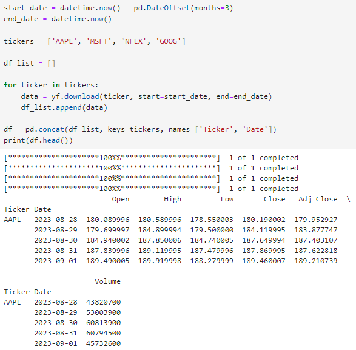
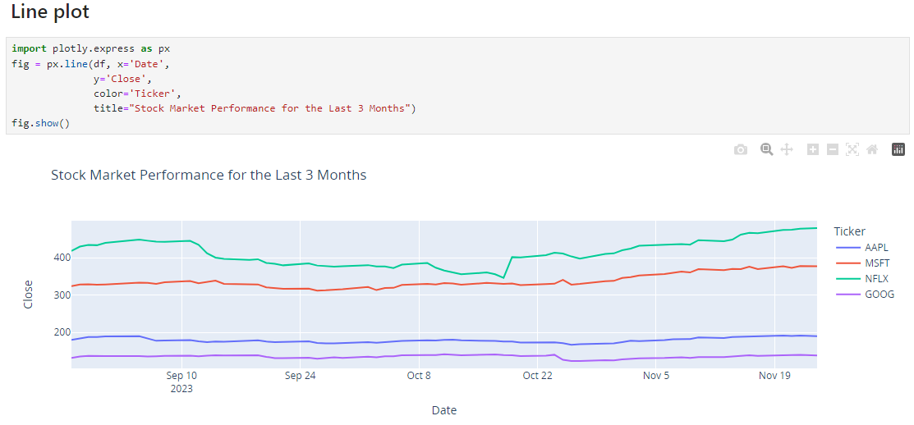
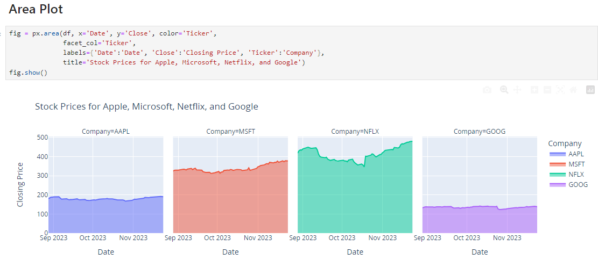
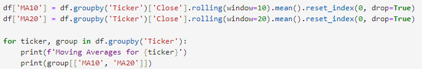
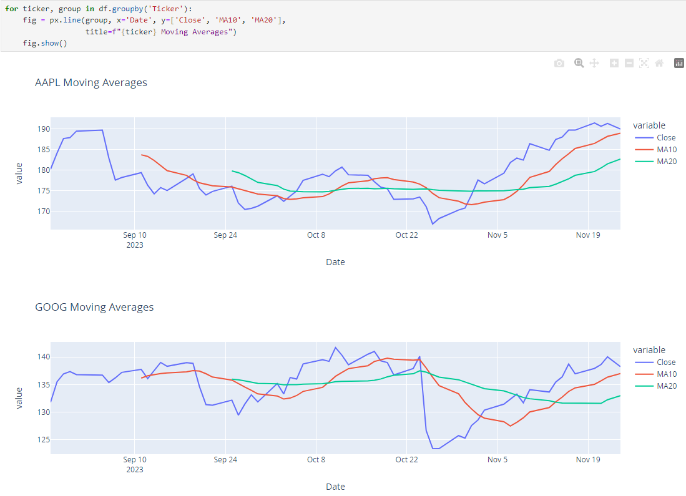
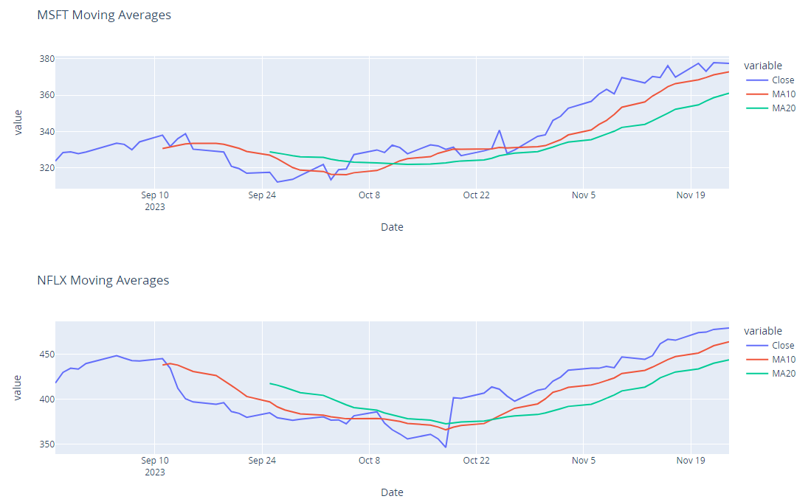
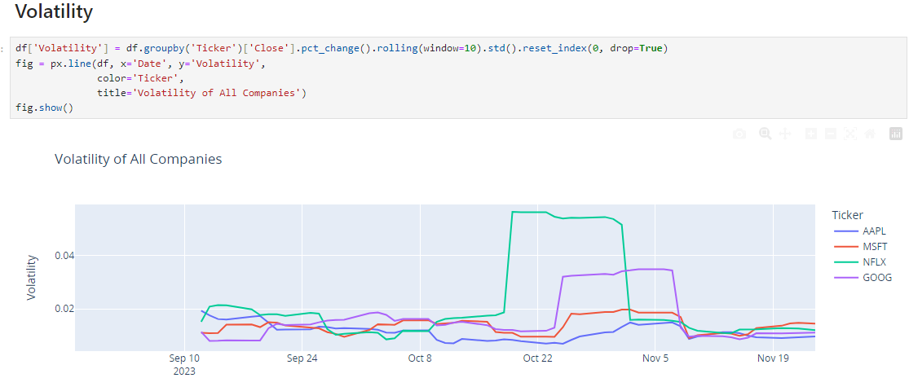
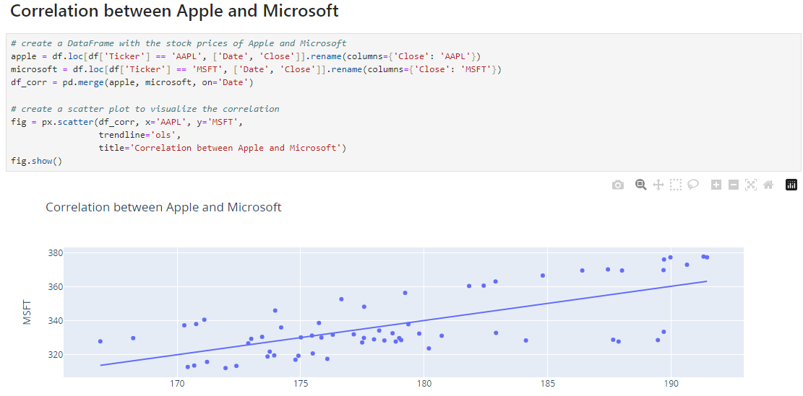

# Stock-Market-Performance-Analysis

## Overview

Stock market performance analysis can be used to inform investment decisions and help investors make informed decisions about buying or selling stocks.  As a data science professional, you can help your business by analyzing the historical performance of different companies, identifying potential opportunities and risks in the stock market, and adjusting your clients’ investment strategies accordingly. As a data science professional, you can go through a structured process of stock market performance analysis, which involves collecting historical stock price data of different companies from trusted sources such as Yahoo Finance, visualizing data using various charts, calculating movements, averages and volatility for each company, and performing correlation analysis to analyze the relationships between different stock prices.

Below is how we can collect real-time stock market data using the yfinance API:

Let’s have a look at the performance in the stock market of all the companies:

Let’s look at the faceted area chart, which makes it easy to compare the performance of different companies and identify similarities or differences in their stock price movements:

Let’s analyze moving averages, which provide a useful way to identify trends and patterns in each company’s stock price movements over a period of time. Here’s how to visualize the moving averages of all companies:

Volatility is a measure of how much and how often the stock price or market fluctuates over a given period of time. Here’s how to visualize the volatility of all companies:

Let’s analyze the correlation between the stock prices of Apple and Microsoft:

## Conclusion

There is a strong linear relationship between the stock prices of Apple and Microsoft, which means that when the stock price of Apple increases, the stock price of Microsoft also tends to increase. It is a sign of a strong correlation or similarity between the two companies, which can be due to factors such as industry trends, market conditions, or common business partners or customers. For investors, this positive correlation may indicate an opportunity to diversify their portfolio by investing in both companies, as both stocks may offer similar potential returns and risks.

Stock Market Performance Analysis involves calculating moving averages, measuring volatility, conducting correlation analysis and analyzing various aspects of the stock market to gain a deeper understanding of the factors that affect stock prices and the relationships between the stock prices of different companies.
